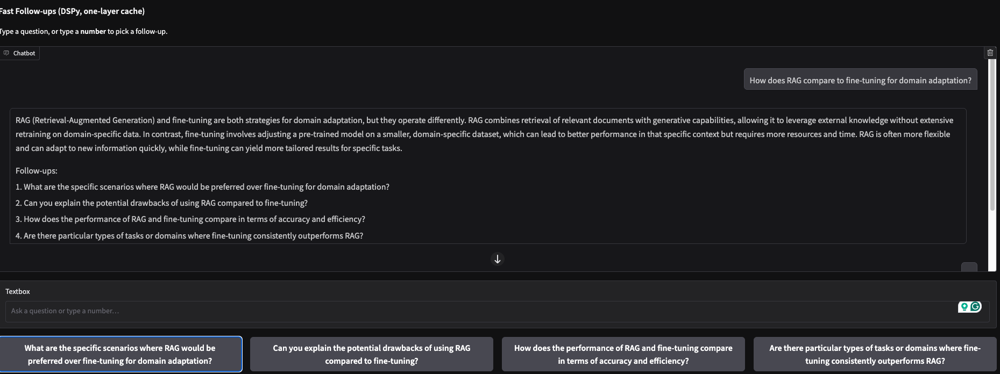
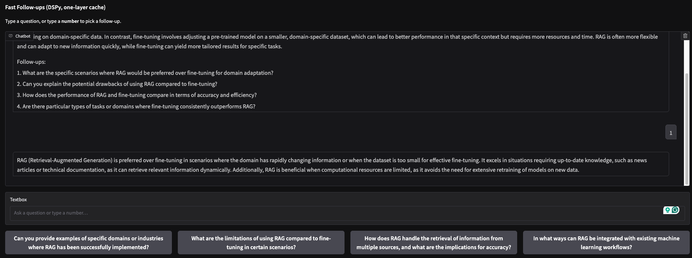

# FastFollow
## Overview

**FastFollow** is a proof-of-concept chat interface that makes conversations **faster and more exploratory**:

- When you ask a question, the system generates:
  - ✅ A clear main answer
  - ✅ A few **follow-up questions** (shown as clickable buttons)
  - ✅ Pre-computed answers to those follow-ups (cached in memory)

- When you click a follow-up button:
  - ⚡ The cached answer is displayed **immediately**
  - 🔄 The system computes the **next layer** of follow-ups in the background
  - 🎯 You can keep digging deeper with instant responses

The design is inspired by real user needs: keep the UX **chat-like**, but remove the frustrating wait for obvious follow-up queries.

---
## Screenshots




---

## Features

- **One-layer caching** → only the current follow-ups are cached, keeping memory simple
- **Instant feedback** → cached follow-up answers appear immediately
- **Gradio UI** → clean chat box with follow-up buttons below
- **DSPy integration** → structured prompt management with `InputField` / `OutputField` signatures
- **Extensible** → swap out models (OpenAI, Anthropic, Azure, etc.) with one line of config

---

## Requirements

* Python 3.9+
* [DSPy](https://github.com/stanfordnlp/dspy)
* [Gradio](https://gradio.app/)

---

## License

MIT License © 2025

---

## Acknowledgements

* [DSPy](https://github.com/stanfordnlp/dspy) for structured prompt programming
* [Gradio](https://gradio.app/) for the chat UI

```
